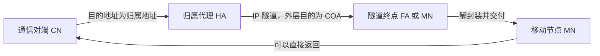

<h1><center>第六节 移动 IP</center></h1>

移动 IP 使主机在跨越不同 IP 网络移动时仍能保留固定的归属地址，并继续接收发往该地址的数据报。以下内容以考研中常见的移动 IPv4 基本机制为背景。

## 1. 移动 IP 的概念

普通 IPv4 地址同时具有两种含义：

- **节点标识**：说明通信对象是谁。
- **网络位置**：地址中的网络前缀说明节点连接在哪个网络。

如果主机移动到另一个 IP 网络后直接改用新地址，原来以旧地址建立的传输层连接可能无法继续。移动 IP 使用两个地址分离身份和当前位置：

- **归属地址**长期标识移动节点，对通信对端保持稳定。
- **转交地址**反映移动节点当前所在的外地网络，用作隧道转发的终点。

移动 IP 关注的是移动节点跨越不同 IP 子网后的可达性。设备仅在同一子网内更换无线接入点，不一定需要移动 IP；底层接入技术是有线还是无线，也不是移动 IP 的判断依据。

### 1.1 基本术语

| 术语 | 含义 |
| --- | --- |
| 移动节点 MN | 能够改变接入网络，同时希望保留固定归属地址的主机或路由器 |
| 归属网络 | 移动节点归属地址所属的网络 |
| 归属地址 | 移动节点在归属网络中的永久 IPv4 地址，用于标识移动节点 |
| 归属代理 HA | 在归属网络中维护移动绑定，并把发往外出移动节点的数据报通过隧道转发到转交地址的路由器 |
| 外地网络 | 移动节点当前访问的、不同于归属网络的网络 |
| 外地代理 FA | 外地网络中为移动节点提供代理服务的路由器，可以提供转交地址、转发注册报文并交付隧道数据 |
| 转交地址 COA | 与移动节点当前位置关联的临时地址，是归属代理隧道转发的终点 |
| 通信对端 CN | 与移动节点通信的其他主机或节点 |
| 移动绑定 | 归属代理保存的“归属地址 $\rightarrow$ 转交地址”映射，具有有效期 |

归属代理并不把移动节点的永久地址改成转交地址。通信对端仍然把移动节点看作使用归属地址，归属代理在网络内部利用绑定关系把数据转到当前位置。

### 1.2 转交地址的类型

传统移动 IPv4 使用两类转交地址：

- **外地代理转交地址**：使用外地代理接口的地址作为 COA。归属代理把隧道数据报发送给外地代理，由外地代理解封装并在本地链路上交付移动节点。多个移动节点可以共享同一个外地代理地址。
- **配置转交地址**：移动节点在外地网络获得一个属于自己的临时地址，例如通过 DHCP 获得。此时移动节点本身是隧道终点并负责解封装，不一定需要外地代理。

无论采用哪种 COA，移动节点对上层通信继续使用归属地址。COA 主要用于定位和隧道转发，不是通信对端必须使用的新永久地址。

### 1.3 移动 IP 的基本思想

移动 IP 可以概括为三项机制：

1. **代理发现**：移动节点发现归属代理或外地代理，并判断自己处于归属网络还是外地网络。
2. **位置注册**：移动节点取得 COA 后向归属代理注册，建立移动绑定。
3. **隧道转发**：归属代理截获发往归属地址的数据报，把它封装后通过隧道发送到 COA。

基本移动 IP 不要求通信对端知道移动节点的实际位置，因此能够保持对通信对端的透明性。但移动 IP 只解决网络层可达性，不自动保证隧道数据的机密性，也不等同于无线链路层的漫游协议。

::: warning 易错点
归属地址用于稳定标识移动节点，转交地址用于表示当前位置；两者同时存在，不能把 COA 理解为永久替换归属地址。外地代理是传统移动 IPv4 的可选角色，使用配置转交地址时可以没有外地代理。
:::

## 2. 移动 IP 通信过程

移动 IP 的完整过程包括代理发现、获得转交地址、向归属代理注册、隧道接收数据、向通信对端发送数据，以及返回归属网络后注销绑定。

### 2.1 移动节点位于归属网络

移动节点在归属网络时使用归属地址正常通信：

- 发往移动节点的数据报按照普通 IP 路由直接交付。
- 归属代理不需要把这些数据报通过移动隧道转发。
- 移动节点发送的数据报也按普通路由送往通信对端。

此时归属地址既标识移动节点，也与其当前网络位置一致。

### 2.2 代理发现与获得转交地址

移动节点进入外地网络后，需要判断当前位置并获得 COA：

1. 归属代理或外地代理周期性发送代理通告；移动节点也可以主动发送代理请求。
2. 移动节点根据收到的通告判断自己位于归属网络还是外地网络。
3. 在外地网络中，移动节点使用外地代理地址作为 COA，或者通过 DHCP 等机制获得配置转交地址。

传统移动 IPv4 的代理通告通常在 ICMP 路由器通告的基础上增加移动代理信息，使移动节点能够识别可用的归属代理或外地代理。

### 2.3 向归属代理注册

移动节点获得 COA 后，需要把当前位置通知归属代理：

1. 使用外地代理 COA 时，移动节点把注册请求发送给外地代理，由外地代理转交归属代理。
2. 使用配置 COA 时，移动节点可以直接向归属代理发送注册请求。
3. 归属代理验证请求，建立或更新“归属地址 $\rightarrow$ COA”的移动绑定，并设置有效期。
4. 归属代理返回注册应答；使用外地代理时，应答再由外地代理转交移动节点。

注册必须具有身份验证和防重放机制，否则攻击者可能伪造注册请求，把发往移动节点的数据重定向到错误位置。注册的有效期到期前需要续期。

### 2.4 通信对端向移动节点发送数据

通信对端通常不知道移动节点已经外出，仍然把数据报的目的地址填写为移动节点的归属地址：

1. 数据报根据普通 IP 路由到达移动节点的归属网络。
2. 归属代理截获发往外出移动节点归属地址的数据报。
3. 归属代理把完整的原数据报封装进一个新的 IP 数据报，形成隧道。
4. 外层数据报的源地址通常是归属代理地址，目的地址是 COA；内层原数据报的目的地址仍是移动节点的归属地址。
5. 数据报到达隧道终点后，外地代理或移动节点去除外层首部，再把原数据报交付移动节点。



使用外地代理 COA 时，外地代理是隧道终点；使用配置 COA 时，移动节点本身是隧道终点。

### 2.5 移动节点向通信对端发送数据

移动节点发送数据时通常有两种方式：

- **直接发送**：移动节点以归属地址作为源地址，经外地网络直接把数据报发送给通信对端。路径较短，但某些网络的入口过滤会拒绝源地址不属于当前外地网络的数据报。
- **反向隧道**：移动节点或外地代理先把数据报通过隧道发送给归属代理，归属代理解封装后再转发给通信对端。该方式路径较长，但可以通过归属网络发送，并适应源地址过滤等限制。

基本移动 IP 中，通信对端到移动节点的数据通常经过归属代理，而移动节点返回通信对端的数据可以直接发送，从而形成三角路由。

### 2.6 三角路由与路由优化

三角路由的三段路径是：

```text
通信对端 → 归属代理 → 移动节点 → 通信对端
```

它的优点是通信对端不需要支持移动 IP，也不必知道移动节点位置；缺点是通信对端到移动节点的数据必须绕经归属网络，可能增加时延、占用额外带宽，并使归属代理成为转发瓶颈。

路由优化可以让通信对端或相关路由器获得移动绑定，直接把数据发送到 COA，从而减少绕行。但绑定信息必须经过认证并及时更新，否则可能产生错误转发或安全风险。路由优化属于对基本移动 IP 的扩展。

### 2.7 返回归属网络

移动节点返回归属网络后：

1. 通过代理通告或其他方式确认已经回到归属网络。
2. 向归属代理注销原来的 COA 绑定。
3. 归属代理删除或停用移动绑定，不再把数据通过隧道转发到外地网络。
4. 发往归属地址的数据恢复普通的本地直接交付。

若移动节点从一个外地网络移动到另一个外地网络，则需要获得新的 COA 并向归属代理重新注册。旧绑定到期或被新绑定替代后，数据才会稳定转发到新位置。

::: warning 易错点
通信对端发出的数据报首先按归属地址到达归属网络，再由归属代理隧道转发到 COA；外层目的地址是 COA，内层目的地址仍是归属地址。移动节点返回归属网络后必须取消外地绑定，恢复普通交付。
:::

::: tip 本节主线
移动节点用归属地址保持身份不变，用 COA 表示当前位置；归属代理维护二者的绑定并把数据隧道转发到外地网络。基本方案会产生三角路由，反向隧道改变返回路径，路由优化则尝试绕过归属代理。
:::
