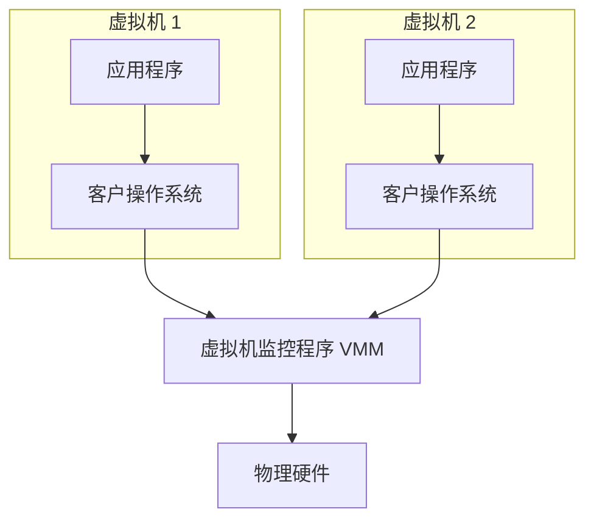

<h1>
第六节 虚拟机
</h1>

## 1. 虚拟机的基本概念

虚拟机（Virtual Machine，VM）是通过虚拟化技术构造出的、具有完整计算机系统功能的逻辑计算机。每台虚拟机拥有虚拟处理器、虚拟内存、虚拟磁盘和虚拟网络设备，可以像独立物理机一样运行客户操作系统及其应用程序。

同一物理机上的多台虚拟机共享底层处理器、内存和 I/O 设备，但其处理器状态、地址空间和虚拟设备状态彼此隔离。虚拟化并没有复制真实硬件，而是由虚拟机监控程序对硬件资源进行复用、映射和保护。

### 1.1 基本组成

- 物理机：提供真实处理器、内存和 I/O 设备的计算机。
- 虚拟机监控程序（VMM，也称 Hypervisor）：创建和管理虚拟机，分配资源，处理客户系统对敏感资源的访问。
- 客户操作系统：运行在虚拟硬件之上，管理虚拟机内部的进程、文件和虚拟设备。
- 宿主操作系统：为第二类 VMM 提供进程、内存和设备服务的操作系统；第一类 VMM 的结构中没有位于 VMM 下方的通用宿主操作系统。

图中表示第一类 VMM 的基本层次。第二类 VMM 与物理硬件之间还存在宿主操作系统。

### 1.2 第一类虚拟机监控程序

第一类 VMM 直接运行在物理硬件之上，控制硬件并管理多个客户操作系统，也称裸机型 Hypervisor。

主要特点：

- 不依赖位于其下方的通用宿主操作系统。
- 对处理器、内存和设备具有直接控制权，调用层次通常较少。
- 通常具有较好的性能和隔离性，常用于服务器和数据中心。

“直接运行在硬件上”不表示 VMM 不需要驱动和管理工具，而是表示它本身承担最底层的资源控制职责。

### 1.3 第二类虚拟机监控程序

第二类 VMM 作为应用程序运行在宿主操作系统之上，也称宿主型 Hypervisor。宿主操作系统直接管理物理硬件，并向 VMM 提供进程调度、内存和设备访问等服务。

主要特点：

- 安装和使用方便，可以利用宿主操作系统已有的设备驱动。
- 适合桌面实验、软件测试和需要同时使用宿主应用的场景。
- 访问硬件通常要经过宿主操作系统，调用路径较长，并会受到宿主系统资源占用和故障的影响。

| 对比项 | 第一类 VMM | 第二类 VMM |
| --- | --- | --- |
| 运行位置 | 直接位于硬件之上 | 作为宿主操作系统中的应用程序运行 |
| 通用宿主操作系统 | 不需要 | 需要 |
| 硬件访问 | 由 VMM 直接控制 | 通常通过宿主操作系统 |
| 典型用途 | 服务器、数据中心 | 桌面测试、教学和个人使用 |
| 一般特点 | 性能和隔离性通常较好 | 安装方便、设备兼容性通常较好 |

### 1.4 基本工作原理与特点

VMM 向每个客户操作系统提供虚拟处理器、虚拟内存和虚拟 I/O 设备，并把它们映射到物理资源：

- VMM 调度虚拟处理器使用物理处理器，并在切换虚拟机时保存、恢复处理器状态。
- VMM 建立虚拟机内存到物理内存的映射，防止不同虚拟机越界访问彼此的内存。
- VMM 模拟或复用 I/O 设备，把客户系统的设备请求转换为对真实设备的受控访问。

客户操作系统虽然管理虚拟机内部的进程、内存和设备，但不能越过 VMM 任意控制物理资源。客户系统执行涉及受保护资源的操作时，需要由 VMM 截获或介入处理，再把结果反映到相应的虚拟硬件状态中。

虚拟机的主要优点是隔离多个运行环境、复用物理资源，并允许同一物理机运行多个客户操作系统；代价是资源映射、状态切换和设备虚拟化会产生额外开销，多台虚拟机同时繁忙时也会竞争物理资源。

::: warning 易错点
第一类 VMM 直接运行在硬件之上，第二类 VMM 作为宿主操作系统中的应用程序运行。虚拟机拥有相对独立的虚拟硬件和客户操作系统，但多台虚拟机仍然共享底层物理资源。
:::
