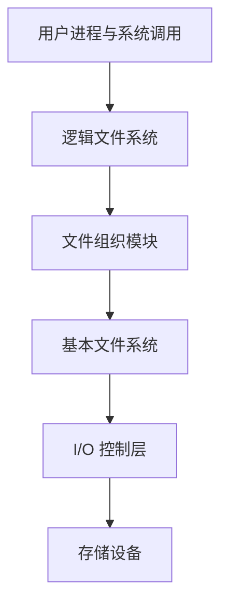

<h1>
第一节 文件系统基础
</h1>

文件系统向用户提供“按名存取”的持久化数据抽象，并负责把文件的逻辑内容映射到外存设备。学习本节时，要区分文件的逻辑结构、访问方法和磁盘上的物理结构。

## 1. 文件的基本概念

### 1.1 文件的定义

文件是以计算机外存为载体、由操作系统统一管理的一组相关信息的集合。它具有以下特点：

- **持久性**：进程结束后，文件内容通常仍然保存在外存中。
- **按名访问**：用户通过文件名和路径访问文件，无须直接操作磁盘块号。
- **独立性**：文件把逻辑数据与具体存储设备、物理位置分离。
- **共享与保护**：文件可被多个用户或进程共享，同时受访问权限约束。

从操作系统角度看，文件既包括数据内容，也包括描述文件的元数据。目录负责把文件名映射到相应的文件控制信息。

### 1.2 文件属性

文件属性通常包括：

| 属性 | 说明 |
| --- | --- |
| 名称 | 供用户识别和按名访问 |
| 标识符 | 文件系统内部唯一标识，如 inode 号 |
| 类型 | 普通文件、目录文件、设备文件等 |
| 位置 | 文件数据在外存中的位置或定位信息 |
| 大小 | 当前文件长度，有时还记录已分配空间 |
| 所有者与组 | 文件所属用户和用户组 |
| 保护信息 | 读、写、执行等访问权限 |
| 时间信息 | 创建、修改和访问时间等 |

文件名通常属于目录项；文件系统内部可使用文件控制块（FCB）或 inode 保存其他元数据。多个文件名可能通过硬链接指向同一个文件对象。

### 1.3 文件类型

常见文件类型包括：

- **普通文件**：保存程序、文本、图像和其他用户数据。
- **目录文件**：保存文件名到文件控制信息的映射，用于组织文件系统命名空间。
- **特殊文件**：把设备或其他内核对象抽象成文件接口，如字符设备文件和块设备文件。

扩展名可以帮助应用程序和用户识别文件类型，但操作系统是否强制解释扩展名取决于具体系统。

### 1.4 文件的基本操作

文件系统的基本操作包括创建、删除、打开、关闭、读和写。打开后，进程使用文件描述符或句柄访问文件。各操作的执行流程、打开文件表和引用计数将在第二节“文件的操作”中详细讨论。

## 2. 文件系统结构

### 2.1 文件系统的功能

文件系统是操作系统中负责文件命名、存储、检索、共享和保护的子系统，主要完成：

- 提供创建、打开、读写、关闭和删除等系统调用接口。
- 管理目录、文件名、属性和访问权限。
- 把文件逻辑块映射为设备上的物理块。
- 分配和回收外存空间。
- 维护文件访问所需的运行时状态。
- 屏蔽不同存储设备和具体文件系统格式的差异。

### 2.2 文件系统的层次结构

典型文件系统可自上而下划分为：

1. **用户调用接口**：接收 `open`、`read`、`write`、`close` 等请求。
2. **逻辑文件系统**：处理目录、文件控制信息、权限和保护。
3. **文件组织模块**：完成文件逻辑块到物理块的映射及空间分配。
4. **基本文件系统**：向下发出通用的块读写请求。
5. **I/O 控制层**：包括设备驱动程序和中断处理程序。
6. **存储设备**：执行实际的数据传输。

分层设计将命名与权限、逻辑块映射、通用块 I/O 和设备控制分离，便于支持不同磁盘和文件系统。

### 2.3 持久化结构与运行时结构

文件系统既需要在外存中保存文件数据和元数据，也需要在内存中维护打开状态。第一节只需理解二者分别服务于“持久保存”和“运行时访问”；超级块、空闲空间结构和打开文件表等具体布局将在第三节“文件系统布局”中讨论。

## 3. 文件的逻辑结构

文件的逻辑结构是用户看到的文件内容组织形式，与文件数据块在磁盘上的物理分配方式不同。

### 3.1 无结构文件

无结构文件也称流式文件，由字节流或字符流组成。操作系统不解释其内部记录格式，应用程序自行规定内容含义。现代通用操作系统中的普通文件通常采用这种形式。

流式文件结构简单、通用性强，适合文本、程序和多媒体数据；但按业务关键字检索通常需要应用程序自行解析。

### 3.2 有结构文件

有结构文件也称记录式文件，由若干逻辑记录组成。记录可以是定长或变长：

- **定长记录**：每条记录长度相同，容易根据记录号直接计算位置。
- **变长记录**：空间利用灵活，但定位记录时通常需要长度信息、分隔符或索引。

常见记录组织方式如下。

#### 顺序文件

记录按某种次序依次排列，可以按写入顺序组织，也可以按关键字排序。顺序访问效率高，适合批量处理；插入、删除和随机查找可能需要移动记录、设置删除标记或使用溢出区。

#### 索引文件

系统为记录建立“关键字—记录地址”索引。查询时先查索引，再定位记录，适合随机检索；代价是需要额外索引空间，插入、删除后还要维护索引。索引较大时可以建立多级索引。

#### 索引顺序文件

索引顺序文件把按关键字有序的记录分组，为每组建立一个索引项。查找时先通过索引确定记录所在组，再在组内顺序查找，兼顾顺序处理与随机检索，索引空间通常少于为每条记录建立索引。

#### 直接文件或散列文件

根据关键字的散列函数直接计算记录所在区域，等值查询速度快，但必须处理散列冲突，且不适合范围查询和按关键字顺序遍历。

### 3.3 文件访问方法

- **顺序访问**：按照文件内容的先后顺序读写，维护当前文件位置指针。
- **直接访问**：根据相对块号、记录号或偏移量直接定位。
- **索引访问**：先查询索引，再访问相应记录。

逻辑结构描述“用户如何组织数据”，访问方法描述“用户如何定位数据”，物理结构描述“数据块如何存放在外存”。三者相互影响，但不能混为同一概念。

::: warning 易错点
索引文件属于文件的逻辑结构；索引分配属于文件的物理结构。前者索引的是逻辑记录，后者索引的是磁盘数据块。
:::
