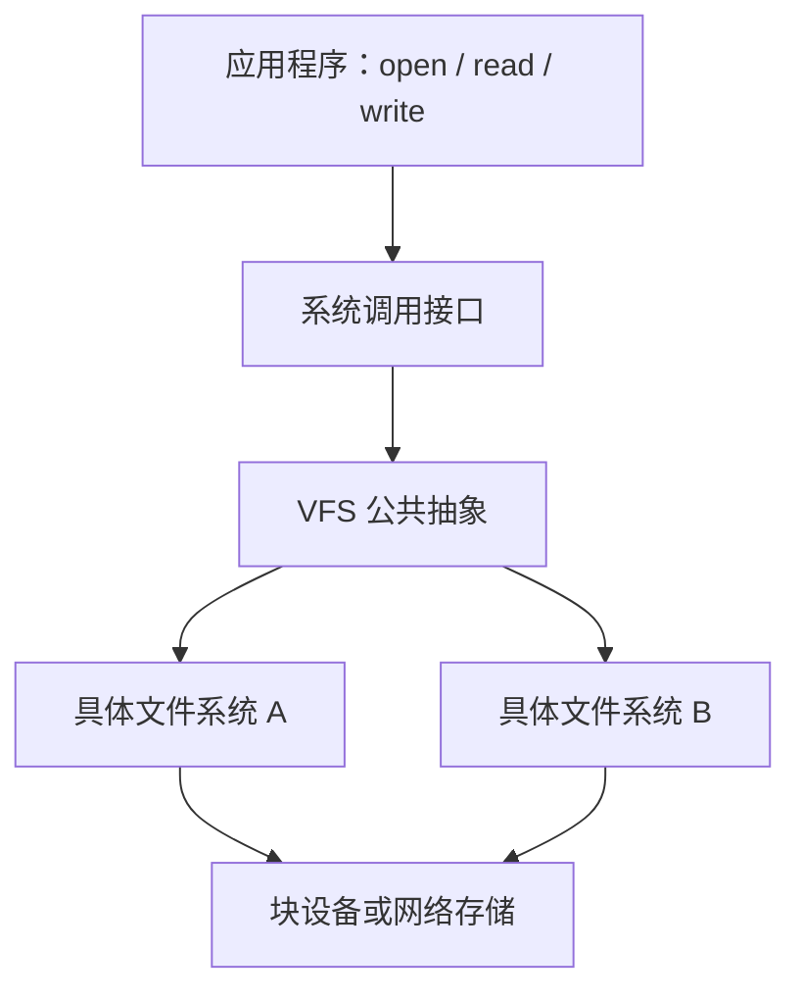

<h1>
第三节 文件系统
</h1>

文件系统实现的主线是：用磁盘布局保存持久化信息，用空闲空间管理分配和回收数据块，用 VFS 提供统一接口，再通过挂载把不同卷接入同一目录树。

## 1. 文件系统布局

### 1.1 磁盘、分区与卷

物理磁盘可以划分为若干分区，一个分区可以创建一个文件系统，也可以将多个设备组合成逻辑卷。文件系统格式化会在卷中建立元数据和初始空闲空间管理结构。

磁盘或卷中的典型布局包括：

| 结构 | 主要内容 |
| --- | --- |
| 引导块 | 启动操作系统所需的引导信息；并非每个卷都实际使用 |
| 超级块 / 卷控制块 | 文件系统类型、块大小、容量、关键区域位置和状态 |
| 空闲空间管理区 | 位示图、空闲块号或其他空间分配信息 |
| FCB / inode 区 | 文件属性、权限和数据块定位信息 |
| 目录区 | 文件名到 FCB/inode 的映射；有些系统把目录作为普通文件存放 |
| 文件数据区 | 普通文件、目录和其他对象的实际数据块 |

超级块是文件系统的全局控制信息。挂载文件系统时，操作系统需要读取并验证超级块；为提高可靠性，重要文件系统可能保存超级块副本。

### 1.2 内存中的文件系统结构

文件系统运行后，会在内存中维护相应的数据结构：

- **挂载表**：记录已挂载文件系统、挂载点和设备等信息。
- **超级块缓存**：保存已挂载卷的全局控制信息。
- **目录项和 inode/vnode 缓存**：加速路径解析和元数据访问。
- **系统级打开文件表**：保存文件偏移、打开方式和引用计数等。
- **进程文件描述符表**：保存文件描述符到打开文件表项的映射。
- **页缓存或块缓存**：缓存文件数据和磁盘块，减少实际设备访问。

外存结构负责持久化，内存结构负责加速访问并保存运行时状态。缓存中的脏数据最终必须写回外存，才能保证持久性。

### 1.3 文件系统布局中的一次访问

访问文件时，系统先通过目录项找到 inode/FCB，再由其中的块地址信息定位文件数据。若相关目录块、inode 和数据块均不在内存，可能产生多次磁盘访问；题目通常会明确哪些信息已在内存中。

## 2. 文件存储空间管理

文件存储空间管理负责记录哪些磁盘块空闲，并在文件增长、缩短和删除时完成分配与回收。

### 2.1 空闲表法

为每个连续空闲区建立“起始块号、空闲块数”表项。它适合寻找连续空间，也容易完成相邻空闲区合并；空闲区非常零散时，表项数量会增多。

### 2.2 空闲链表法

将空闲磁盘块或空闲区用指针链接起来：

- **空闲盘块链**：每个节点对应一个空闲块，分配单块方便，但难以快速寻找大量连续块。
- **空闲盘区链**：每个节点记录一片连续空闲区，更适合连续分配。

指针通常存放在空闲块内部，因此不一定需要很大的独立内存表，但遍历可能产生磁盘访问。

### 2.3 位示图

位示图用一个二进制位表示一个磁盘块的状态。例如约定 0 表示空闲、1 表示已分配。

若磁盘共有 $N$ 个块，则位示图至少占用：

$$
\left\lceil\frac{N}{8}\right\rceil\text{ B}.
$$

若每个机器字有 $w$ 位，块号 $b$ 对应：

$$
\text{字号}=\left\lfloor\frac{b}{w}\right\rfloor,
\qquad
\text{字内位号}=b\bmod w.
$$

位示图便于查找单个或连续空闲块，也便于统计空间使用情况；大型卷的位示图本身可能较大，通常分块缓存。

### 2.4 成组链接法

成组链接法把若干空闲块号组成一组，将组内块号和下一组信息保存在特定空闲块中。系统在内存或超级块中保留当前组的块号，用完后再读入下一组。

该方法结合了空闲表和空闲链的思想，适合管理大量磁盘块，传统 UNIX 文件系统曾采用这种方式。

## 3. 虚拟文件系统

虚拟文件系统（VFS）位于系统调用接口与具体文件系统之间，为应用程序提供统一的文件操作抽象。

### 3.1 VFS 的作用

- 为不同文件系统提供统一的 `open`、`read`、`write`、`close` 等接口。
- 统一表示文件、目录、打开实例和文件系统卷。
- 完成跨挂载点的路径解析。
- 将通用操作分派到具体文件系统实现。
- 支持本地磁盘文件系统、网络文件系统和特殊文件系统共存。

### 3.2 常见 VFS 对象

| 抽象对象 | 含义 |
| --- | --- |
| 超级块对象 | 一个已挂载文件系统的全局信息 |
| inode/vnode 对象 | 一个具体文件对象的元数据和操作 |
| 目录项对象 | 路径中的文件名及其与 inode/vnode 的关联 |
| 文件对象 | 一次打开实例，保存偏移和打开标志等运行时状态 |

具体系统名称可能不同，但都需要解决“统一接口—具体实现”之间的映射问题。VFS 自身不规定磁盘上必须采用哪一种文件格式。

## 4. 文件系统挂载

挂载是把一个文件系统的根目录接入现有目录树中某个目录（挂载点）的过程。

### 4.1 挂载过程

1. 指定包含文件系统的设备、卷或网络资源。
2. 指定现有目录树中的挂载点。
3. 读取并验证超级块或卷控制信息。
4. 创建内存超级块对象并登记挂载表。
5. 建立挂载点目录与新文件系统根目录的关联。

挂载后，路径解析到达挂载点时会转入被挂载文件系统。挂载点原有内容只是暂时被遮蔽，并未被删除；卸载后通常重新可见。

系统启动时会先建立根文件系统，再按配置挂载其他文件系统。不同文件系统可以具有不同的磁盘格式，但通过 VFS 统一到一棵目录树中。

::: warning 易错点
VFS 解决统一接口问题，挂载解决文件系统如何接入目录树的问题；格式化负责在卷中建立文件系统布局，三者不能混为一谈。
:::
