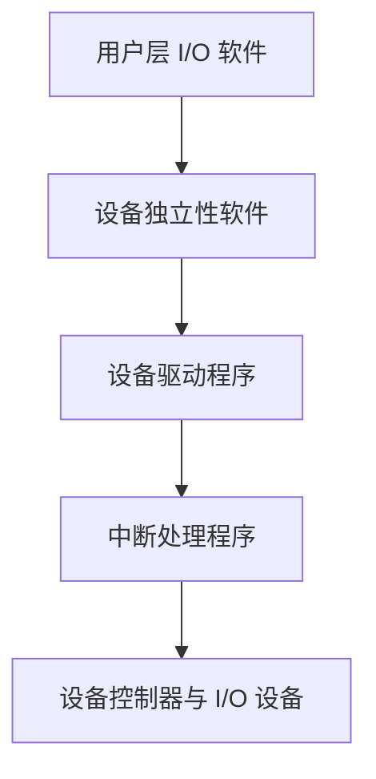

<h1>
第一节 I/O 管理概述
</h1>

I/O 管理负责协调处理机、内存与外部设备之间的数据交换，并向应用程序提供统一、方便且安全的设备访问方式。它需要屏蔽设备差异，完成设备控制、缓冲、分配、保护与错误处理等工作。

## 1. I/O 设备

### 1.1 I/O 设备的分类

I/O 设备是能够与计算机交换数据的外部设备，常见分类如下。

| 分类依据 | 类型 | 典型设备与特点 |
| --- | --- | --- |
| 使用特性 | 人机交互设备、存储设备、网络通信设备 | 键盘和显示器；磁盘和固态硬盘；网卡等 |
| 信息交换单位 | 字符设备、块设备 | 字符设备按字符流顺序传输；块设备按数据块传输并通常支持随机访问 |
| 共享属性 | 独占设备、共享设备、虚拟设备 | 独占设备同一时刻只分配给一个进程；共享设备允许多个进程交替访问；虚拟设备利用软件将独占设备改造成可共享的逻辑设备 |
| 传输速率 | 低速、中速、高速设备 | 不同速率需要采用不同的控制和缓冲策略 |

字符设备、块设备等分类反映的是操作系统向上提供的访问模型，不应只根据设备的物理外形判断。例如，终端通常按字符流访问，磁盘通常按块访问，网络设备则常提供专门的报文或套接字接口。

### 1.2 I/O 控制器

CPU 通常不直接控制设备的机械或电子部件，而是通过 I/O 控制器（设备控制器）与设备通信。控制器接收 CPU 的命令，控制设备执行操作，并向 CPU 报告设备状态。

控制器通常包含以下寄存器：

- 数据寄存器：暂存 CPU 与设备之间交换的数据。
- 状态寄存器：记录就绪、忙、完成、出错等状态。
- 控制寄存器：保存 CPU 发出的读、写、复位等命令及控制信息。

设备与控制器不一定一一对应：一个控制器可以连接一个或多个设备，一个设备也可能包含多个功能单元。

### 1.3 I/O 端口的编址

CPU 访问控制器寄存器有两种基本方式。

| 编址方式 | 地址空间 | 访问指令 | 特点 |
| --- | --- | --- | --- |
| 独立编址（端口映射 I/O） | I/O 端口与内存分别编址 | 使用专门的 I/O 指令 | 不占用内存地址空间，但指令种类受限 |
| 统一编址（内存映射 I/O） | 控制器寄存器映射到内存地址空间 | 使用普通访存指令 | 编程灵活，但会占用部分内存地址空间 |

这里的“内存映射 I/O”是控制器寄存器的编址方法，不等同于应用程序通过 `mmap` 等机制建立的文件内存映射。

## 2. I/O 控制方式

I/O 控制方式的演变目标是减少 CPU 对数据传输过程的直接干预，提高 CPU 与设备的并行程度。

### 2.1 程序直接控制方式

CPU 向控制器发出命令后不断查询状态寄存器，直到设备就绪，再由 CPU 在设备控制器的数据寄存器与内存之间传送数据。

- 优点：实现简单，硬件开销小。
- 缺点：CPU 需要忙等待，并直接参与每次数据传送，利用率低。

### 2.2 中断驱动方式

CPU 发出 I/O 命令后可以转去执行其他程序；设备就绪或操作完成时，控制器发出中断，CPU 执行中断处理程序完成后续传送或处理。

- 优点：消除了对设备状态的持续轮询，CPU 与设备可以并行工作。
- 缺点：通常每传送一个字或较小的数据单位就需要一次中断，CPU 仍要参与数据搬运，频繁中断的开销较大。

### 2.3 DMA 方式

直接存储器存取（DMA）由 DMA 控制器在设备控制器与内存之间成块传送数据。CPU 只需设置传送方向、内存起始地址、设备地址和传送长度；数据块传送完成后，DMA 控制器通过中断通知 CPU。

DMA 控制器通常具有命令/状态寄存器、内存地址寄存器、数据计数器等。传送过程中，内存地址递增、计数器递减，计数为零时表示本次传送完成。

DMA 减少了 CPU 搬运数据和处理中断的次数，但 CPU 仍要初始化 DMA、处理完成中断，而且 DMA 会与 CPU 竞争内存总线。

三种控制方式的核心比较如下。

| 控制方式 | CPU 是否忙等 | 数据传送的主要执行者 | CPU 通常被通知的频率 | CPU 干预程度 |
| --- | --- | --- | --- | --- |
| 程序直接控制 | 是 | CPU | 无需完成中断，CPU 持续查询 | 最高 |
| 中断驱动 | 否 | CPU | 每个字或较小单位一次 | 较高 |
| DMA | 否 | DMA 控制器 | 每个数据块一次 | 较低 |

## 3. I/O 软件层次结构

I/O 软件自上而下逐步把抽象请求转换成硬件操作，完成通知则自下而上返回。

各层的主要职责如下。

1. 用户层 I/O 软件：提供库函数和方便的调用形式，完成格式化、用户态缓冲等工作，并通过系统调用请求内核服务。
2. 设备独立性软件：提供统一命名和访问接口，完成保护、设备分配、缓冲、差错报告，并把逻辑设备请求交给相应驱动程序。
3. 设备驱动程序：与具体控制器和设备相关，把上层抽象命令转换为控制器能够执行的操作，设置控制器寄存器并启动设备。
4. 中断处理程序：保存现场，判断中断原因，读取设备状态，处理完成或错误信息，唤醒等待进程，最后恢复被中断程序的执行。
5. 设备控制器与 I/O 设备：执行实际的数据传送和物理操作，并在就绪、完成或出错时更新状态或发出中断。

::: tip 层次辨析
设备独立性软件处理各类设备共有的功能；设备驱动程序处理特定设备的控制细节；中断处理程序负责响应设备发出的中断。三者不能相互替代。
:::

## 4. 应用程序 I/O 接口

应用程序一般不直接操作控制器寄存器，而是通过系统调用和库函数使用设备。操作系统常把设备抽象为文件或其他统一对象，用文件描述符或句柄标识已经打开的 I/O 对象。

### 4.1 按设备类型提供的接口

| 接口类型 | 常见操作 | 主要特点 |
| --- | --- | --- |
| 字符设备接口 | `get`、`put`、`read`、`write` | 按字符或字节流顺序访问，通常不能任意定位 |
| 块设备接口 | `read`、`write`、`seek` | 按数据块访问，通常支持随机定位；文件系统一般建立在块设备之上 |
| 网络设备接口 | 创建、绑定、连接、发送、接收 | 通常采用套接字接口，以报文或字节流方式通信 |

对于难以用普通读写表达的设备控制操作，系统可提供类似 `ioctl` 的控制接口，用于设置设备参数、工作模式或获取特殊状态。

### 4.2 阻塞与非阻塞 I/O

- 阻塞 I/O：调用暂时不能完成时，调用进程进入阻塞态，等待操作可以继续或完成后再返回。
- 非阻塞 I/O：调用立即返回已经取得的结果或“暂不可用”状态，进程可以继续运行，并在稍后重试或轮询。

阻塞与非阻塞描述的是“调用不能立即满足时，进程是否等待”。

::: warning 易错点
DMA 负责设备控制器与内存之间的成块传送，但 CPU 仍需初始化 DMA，并在传送完成后处理中断。采用 DMA 不等于 CPU 完全不参与 I/O。
:::
