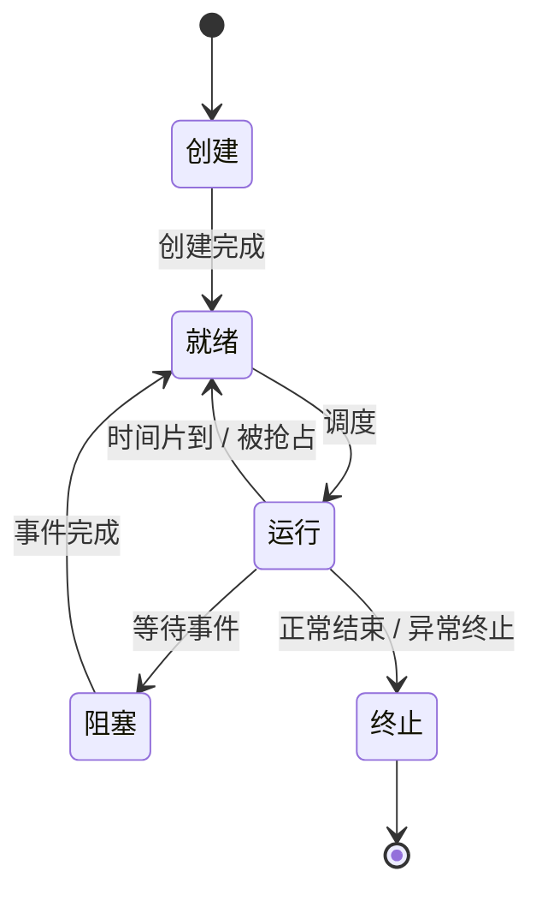
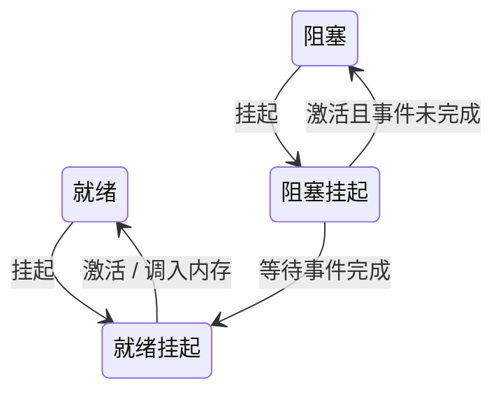

<h1>
第一节 进程与线程简介
</h1>

## 1. 进程的概念和特征

进程实体由程序段、数据段和**进程控制块**（PCB）组成，其中 PCB 是进程存在的唯一标志。

进程具有以下特征：

- **动态性**：进程是程序的执行过程，具有创建、运行和终止的生命周期。
- **并发性**：多个进程可在一段时间内交替推进；在多核系统上还可能真正并行执行。
- **独立性**：进程拥有相对独立的地址空间和资源。在未引入线程的系统中，进程也可作为调度单位；引入线程后，线程成为处理器调度的基本单位。
- **异步性**：各进程以不可预知的速度推进，结果正确性需要通过同步机制保证。
- **结构性**：进程由程序段、数据段和 PCB 等结构化信息构成。

## 2. 进程的组成

进程实体（又称进程映像）由**程序段**、**数据段**和 **进程控制块（PCB）** 三部分组成，其中 PCB 是进程存在的唯一标志。

| 组成部分 | 主要内容 | 说明 |
| --- | --- | --- |
| 程序段 | 可执行的机器指令、只读常量 | 只读，可被多个进程共享 |
| 数据段 | 全局变量、静态变量等运行期数据 | 进程运行期间可读写 |
| 进程控制块（PCB） | 进程的描述信息与控制信息 | 常驻内存，操作系统据此感知和管理进程 |

**PCB 中保存的信息**可分为四类：

- **进程描述信息**：进程标识符（PID）、用户标识符（UID），用于区分进程并确定其归属。
- **进程控制和管理信息**：进程当前状态、优先级、程序入口地址、正在等待的事件或资源。
- **资源清单**：进程占用的内存区域、打开的文件、使用的 I/O 设备等。
- **处理机相关信息**：程序计数器、通用寄存器、状态字、栈指针等现场信息。

操作系统通过 PCB 实现对进程的管理：进程被切换出去时，现场信息保存在 PCB 中；再次被调度时，再从 PCB 中恢复现场。内核中最常访问的数据结构就是 PCB。

**PCB 的组织方式**决定内核按状态查找和调度进程的效率：

| 方式 | 做法 | 特点 |
| --- | --- | --- |
| 链接方式 | 把同一状态的 PCB 用指针链接成队列 | 组织简单，取队首方便；查找特定进程需遍历队列 |
| 索引方式 | 为每种状态建立索引表，表项指向相应的 PCB | 可按状态随机定位，但需要额外的索引表空间 |

## 3. 进程的内存映像

进程的内存映像是进程在内存中的逻辑布局，典型组成如下：

| 区域 | 主要内容 | 特点 |
| --- | --- | --- |
| 代码段（text） | 可执行指令、只读常量 | 通常只读，可在多个进程间共享 |
| 数据段（data/bss） | 已初始化与未初始化的全局、静态变量 | 生命周期贯穿进程运行期 |
| 堆（heap） | 动态分配对象 | 一般向高地址增长 |
| 内存映射区 | 共享库、映射文件、共享内存 | 由系统按需映射 |
| 栈（stack） | 函数调用帧、局部变量、返回地址 | 一般向低地址增长，每线程独有 |

地址空间是进程隔离的基础。同一进程的线程共享代码、数据、堆、打开文件等进程资源，但每个线程都拥有独立的程序计数器、寄存器现场、栈和线程控制块（TCB）。

## 4. 进程的状态与转换

基本三态为运行态、就绪态和阻塞态；加上创建态和终止态后构成五态模型。

- **运行态**：正在处理器上执行。
- **就绪态**：已具备运行条件，只等待处理器。
- **阻塞态**：等待 I/O 完成、资源可用等事件，暂时不能运行。
- **创建态 / 终止态**：分别对应建立和撤销进程实体的阶段。

```mermaid
stateDiagram-v2
    [*] --> 创建
    创建 --> 就绪: 创建完成
    就绪 --> 运行: 调度
    运行 --> 就绪: 时间片到 / 被抢占
    运行 --> 阻塞: 等待事件
    阻塞 --> 就绪: 事件完成
    运行 --> 终止: 正常结束 / 异常终止
    终止 --> [*]
```

阻塞态不能直接转换为运行态：事件到达后，进程必须先进入就绪队列，再由调度器选择执行。

### 4.1 挂起状态

当内存紧张、用户请求暂停或系统需要调整负载时，操作系统可将进程暂时移出内存，形成挂起状态：

- **就绪挂起态**：进程已具备运行条件，但其映像暂不在内存中；被激活并调入内存后转为就绪态。
- **阻塞挂起态**：进程既在等待事件，其映像又被移出内存；等待事件完成后转为就绪挂起态，而不是直接进入就绪态。

```mermaid
stateDiagram-v2
    就绪 --> 就绪挂起: 挂起
    就绪挂起 --> 就绪: 激活 / 调入内存
    阻塞 --> 阻塞挂起: 挂起
    阻塞挂起 --> 阻塞: 激活且事件未完成
    阻塞挂起 --> 就绪挂起: 等待事件完成
```

只有处于活动就绪态且已在内存中的进程，才能经处理器调度进入运行态。

## 5. 进程控制

进程控制由内核中的**原语**完成。原语在并发执行意义上必须保持不可分割，其他相关执行活动不能观察或破坏其不一致的中间状态；具体可由关中断、硬件原子指令或锁机制保证其原子性。

| 操作 | 主要工作 |
| --- | --- |
| 创建 | 建立 PCB、分配资源、初始化现场并进入就绪队列 |
| 终止 | 回收资源、撤销 PCB，必要时处理其子进程 |
| 阻塞 | 保存现场，修改状态并转入相应等待队列 |
| 唤醒 | 将等待事件已满足的进程转入就绪队列 |
| 切换 | 保存当前上下文，恢复下一个进程的上下文 |

创建和终止是进程控制中最基本的两种操作。进程的创建通常经历以下步骤：

1. 为新进程申请 PCB，并填写进程标识、初始状态和优先级等信息。
2. 为程序、数据、用户栈和内核栈分配或建立地址空间映射。
3. 装入可执行文件，初始化程序计数器、寄存器和栈指针。
4. 将 PCB 插入就绪队列，等待调度器选中执行。

进程终止时，系统回收其内存、文件和其他资源，撤销 PCB；父进程可通过等待机制获取子进程的终止状态。

进程切换会涉及寄存器、程序计数器、栈指针、页表等上下文的保存或恢复，也会破坏部分缓存和 TLB 内容，因此具有明显开销。处理器从用户态进入内核态不一定发生进程切换；但发生进程切换必须由内核参与。

## 6. 进程的通信

进程地址空间相互隔离，若需交换数据或协调执行，需要使用进程间通信（IPC）机制。

| 方式 | 适用特点 | 主要注意点 |
| --- | --- | --- |
| 共享内存 | 大量数据的高速交换 | 需配合锁、信号量等完成同步与互斥 |
| 消息传递 | 通过 `send` / `receive` 交换消息 | 可直接通信，也可经消息队列或信箱间接通信 |
| 管道 | 内核维护的字节流，常用于亲缘进程 | 普通管道通常单向；命名管道可供无亲缘进程使用 |
| 信号 | 异步通知事件 | 只适合传递少量控制信息，不适合大量数据 |

共享内存侧重“共享同一份数据”，消息和管道侧重“传递数据”，信号侧重“通知事件”。无论采用何种机制，都要考虑通信双方的同步次序与并发访问安全。

## 7. 进程和多线程模型

线程的引入使一个进程能并发处理多个任务，例如浏览器可分别用线程处理界面、网络与渲染。相较于创建进程，创建和切换线程通常更轻量；共享地址空间也让线程间通信更快，但同步错误更容易直接破坏进程数据。

用户级线程由用户态线程库管理，内核级线程由操作系统内核管理。二者的映射决定阻塞范围和并行能力：

| 模型 | 映射关系 | 特点 |
| --- | --- | --- |
| 多对一 | 多个用户线程 → 一个内核线程 | 用户态切换快；一次阻塞系统调用可能阻塞整个进程，不能多核并行 |
| 一对一 | 一个用户线程 → 一个内核线程 | 一个线程阻塞通常不影响其他线程，可多核并行；内核管理开销较大 |
| 多对多 | 多个用户线程 → 多个内核线程 | 兼顾用户态调度灵活性与内核并行能力，实现更复杂 |

::: warning 易错点
进程是资源分配的基本单位，线程是独立调度的基本单位；同进程线程共享地址空间，但不共享各自的栈和寄存器现场。多对一模型中，一个线程进入阻塞系统调用可能使整个进程无法继续运行。
:::
